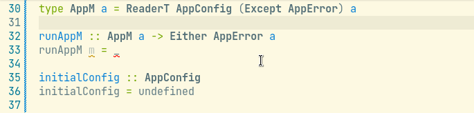

# Program Synthesis with GHC

This is the repository for work on program synthesis with Haskell and the GHC. There are two parts of this repository, a VSCode extension under `vscode` and a Haskell command line tool under `hs`.

## Introduction

The main objective of this program is to automatically generate the definition of unwrapper functions for arbitrary monad transformer stacks. For example, consider the following transformer stack, which combines the effects of `Reader` and `Except`:

```hs
data AppConfig

initialConfig :: AppConfig
initialConfig = undefined

data AppError

type AppM a = ReaderT AppConfig (ExceptT AppError Identity) a
```

Here, we need some "run" function to unwrap a computation of type `AppM a` into the inner value of type `a`. We can write such a function like so:

```hs
runAppM :: AppM a -> Either AppError a
runAppM m = runIdentity (runExcept (runReaderT m initialConfig))
```

This definition is essentially mechanical: we only need to find the appropriate unwrapper function for each level of the stack and then glue them together. Using this tool, the definition for `runAppM` can be automatically generated. Here's a quick demo:



## Usage

The Haskell program under `hs` can be built using `cabal`. To run the program on its own (outside of the extension), call the program with a Haskell file and the target function name/parameter name. For instance, to generate the above example in this repository, run the following command:

```
$ cabal run synthesis-tools -- hs/src/Example.hs runAppM m
```

To run the program through the extension, first the Haskell program must be installed system-wide. To do this, run 

```
$ cabal install exe:synthesis-tools
```

This should add the program `synthesis-tools` to your PATH variable. Next, install the VSCode extension found under `vscode`. Then, in the desired Haskell file, select the desired unwrapping function (the name of the function must start with "run"), and use the VSCode hint "Generate definition...". If there is an error, it will be logged in the extension's console.

## Acknowledgements

This work was completed as part of a Mentored Advanced Project (MAP) at Grinnell College. Thank you to my collaborator Hanfeng Lu, our advisor Peter-Michael Osera, and the College for making this all possible